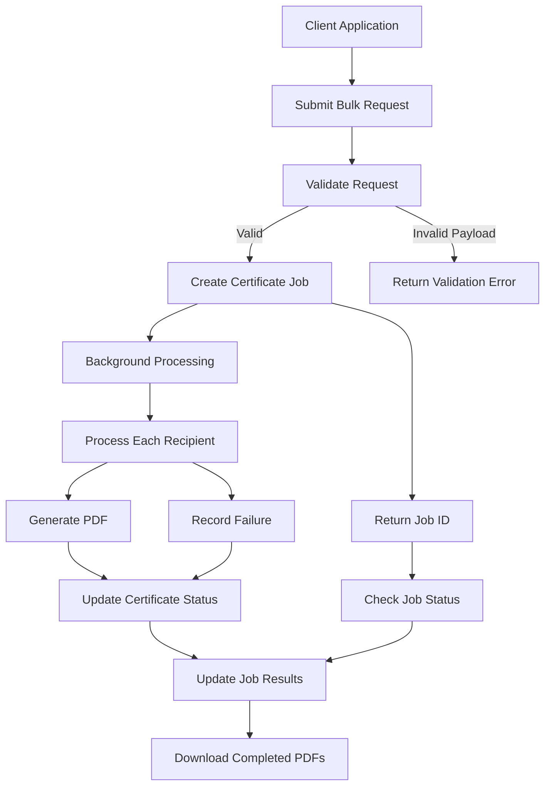

# 🏆 Bulk Certificate Generator

### ⚡ Generate More. Wait Less. Celebrate Every Achievement.

A powerful, API-driven certificate generation service that automates the creation of personalized PDF certificates in bulk. Submit a single request, track generation progress, and download individual certificates — all through a clean REST API.

<p align="center">
  
  
  
  
  
</p>

<p align="center">
  <b>🚀 Automate certificate creation with a simple API.</b>
</p>

---

## 📌 Table of Contents

- [✨ Overview](#-overview)
- [💡 The Problem](#-the-problem)
- [🎯 Key Features](#-key-features)
- [🛠️ Tech Stack](#️-tech-stack)
- [🏗️ How It Works](#️-how-it-works)
- [📂 Project Structure](#-project-structure)
- [⚙️ Getting Started](#️-getting-started)
- [📖 API Documentation](#-api-documentation)
- [🧪 Run Tests](#-run-tests)
- [🔮 Future Enhancements](#-future-enhancements)
- [🤝 Contributing](#-contributing)
- [👨‍💻 Author](#-author)

---

## ✨ Overview

Creating hundreds of certificates manually is repetitive, time-consuming, and prone to errors.

**Bulk Certificate Generator** simplifies this process through a backend API that accepts recipient information, processes certificate generation in the background, records the results, and provides downloadable PDF files.

Whether you're organizing a workshop, conducting a training program, hosting a seminar, or managing an educational event, this project provides a foundation for scalable certificate automation.

### 🌟 Built for automation. Designed for reliability.

## 💡 The Problem

Traditional certificate creation often involves:

- ⏳ Repetitive manual work for every participant.
- ❌ Errors in recipient names and certificate records.
- 🐌 Long waiting times when generating large batches.
- 🔍 Difficulty tracking which certificates succeeded or failed.
- 📁 Extra effort to organize and retrieve generated files.

### ✅ The Solution

This project automates certificate generation through a REST API, supports background processing, tracks individual certificate statuses, and isolates recipient-level failures so one unsuccessful certificate does not stop the entire batch.

---

## 🎯 Key Features

| Feature | Description |
|---|---|
| 📦 Bulk Generation | Submit multiple recipients in one request. |
| ⚡ Background Processing | Receive a job ID without waiting for every PDF to finish. |
| 📊 Job Status Tracking | Check progress and view completed, failed, and pending certificates. |
| 🛡️ Failure Isolation | A recipient-level failure does not block the remaining certificates. |
| 📄 PDF Generation | Generate personalized PDF certificates using ReportLab. |
| ⬇️ Individual Downloads | Download completed certificates through dedicated endpoints. |
| 🗄️ Database Persistence | Store job and certificate records using SQLAlchemy. |
| 🔌 REST API | Integrate certificate generation into other applications. |
| 📚 Interactive API Docs | Explore and test endpoints using Swagger UI. |
| 🧪 Automated Tests | Run the test suite with pytest. |

---

## 🛠️ Tech Stack

<p>
  
</p>

- **Language:** Python 3.12+
- **Backend Framework:** FastAPI
- **Database Layer:** SQLAlchemy
- **Database:** SQLite by default, configurable through `DATABASE_URL`
- **PDF Engine:** ReportLab
- **Testing:** pytest
- **API Documentation:** Swagger UI / OpenAPI

---

## 🏗️ How It Works



### 🔄 Workflow

1. **Submit:** Send event details and recipient information through the API.
2. **Validate:** Check the request structure and required fields.
3. **Queue:** Create a job and return an HTTP `202 Accepted` response.
4. **Process:** Generate certificates in the background, handling each recipient independently.
5. **Track:** Retrieve job progress and individual certificate results.
6. **Download:** Access the generated PDF for each completed certificate.

---

## 📂 Project Structure

```text
bulk-certificate-generator/
│
├── app/
│   ├── main.py                 # Application entry point
│   ├── routers/                # API endpoints
│   ├── services/               # Business logic and job processing
│   └── models/                 # Database models
│
├── tests/                      # Automated tests
├── requirements.txt            # Python dependencies
├── .gitignore
└── README.md
```

*Note: The folder tree illustrates the intended architecture. Adjust it to match the exact files and folders in your repository.*

---

## ⚙️ Getting Started

Follow these steps to run the project locally.

### Prerequisites

Make sure you have installed:

- Python 3.12 or newer
- Git
- A terminal or code editor such as Visual Studio Code

### 1️⃣ Clone the repository

```bash
git clone https://github.com/HarishRavikumar510/bulk-certificate-generator.git
```

### 2️⃣ Navigate into the project

```bash
cd bulk-certificate-generator
```

### 3️⃣ Create a virtual environment

```bash
python -m venv .venv
```

### 4️⃣ Activate the environment

**Windows — Command Prompt or PowerShell:**

```powershell
.venv\Scripts\activate
```

**macOS / Linux:**

```bash
source .venv/bin/activate
```

### 5️⃣ Install dependencies

```bash
python -m pip install --upgrade pip
pip install -r requirements.txt
```

### 6️⃣ Start the application

```bash
uvicorn app.main:app --reload
```

🎉 Your API is now running locally!

| Resource | URL |
|---|---|
| API Base URL | http://127.0.0.1:8000 |
| Swagger UI | http://127.0.0.1:8000/docs |
| Health Check | http://127.0.0.1:8000/health |

*These URLs assume the default local configuration.*

---

## 📖 API Documentation

Explore and test the API through Swagger UI:

👉 **[Open Interactive API Documentation](http://127.0.0.1:8000/docs)**

Start the application locally before opening this link.

### 1. Submit a Certificate Generation Job

**Endpoint:** `POST /api/certificate-jobs`

**Example request:**

```json
{
  "event_name": "AWS Cloud Practitioner Workshop",
  "event_date": "2025-01-15",
  "recipients": [
    {
      "name": "Harish Ravikumar",
      "email": "harish@example.com"
    },
    {
      "name": "Priya Sharma",
      "email": "priya@example.com"
    }
  ]
}
```

**Expected behavior:** The API accepts the job and returns a job resource with its identifier and initial status.

> The example date and recipient information are sample data. Use the date format and fields supported by the application.

### 2. Track Job Progress

**Endpoint:** `GET /api/certificate-jobs/{job_id}`

Retrieve the job status, total recipient count, completed certificates, failed certificates, pending certificates, and individual results.

### 3. Download a Certificate

**Endpoint:**

```text
GET /api/certificate-jobs/{job_id}/certificates/{certificate_id}/download
```

Download the generated PDF for a certificate whose status is `COMPLETED`.

---

## 🧪 Run Tests

Run the automated test suite from the project root:

```bash
python -m pytest -v
```

The test suite uses an in-memory SQLite database and temporary PDF output, keeping test operations separate from real application data.

---

## 🔮 Future Enhancements

Potential improvements for future versions include:

- 🎨 Custom certificate templates and styling.
- 📧 Automated email delivery of generated certificates.
- ☁️ Cloud storage for PDF files.
- 🔄 Retry mechanisms for failed generation jobs.
- 📈 A dashboard for monitoring bulk generation.
- 🔐 Authentication and API rate limiting.
- 📡 Real-time progress updates using WebSockets or Server-Sent Events.
- 🐳 Docker-based deployment.

These are possible extensions, not claims about features already implemented.

---

## 🤝 Contributing

Contributions, suggestions, and bug reports are welcome!

1. Fork this repository.
2. Create a feature branch.
3. Implement your changes.
4. Run the tests.
5. Open a pull request describing your improvements.

For significant changes, open an issue first to discuss the proposed approach.

---

## 👨‍💻 Author

**Harish Ravikumar**

Building practical software solutions through automation, backend development, and API engineering.

- 💻 GitHub: [@HarishRavikumar510](https://github.com/HarishRavikumar510)
- 🚀 Project Repository: [Bulk Certificate Generator](https://github.com/HarishRavikumar510/bulk-certificate-generator)

---

## ⭐ Support the Project

If you find this project useful, consider giving the repository a ⭐ on GitHub.

**Automate the repetitive. Focus on the meaningful. Celebrate every achievement.** 🏆

<p align="center">
  Made with ❤️ and Python
</p>